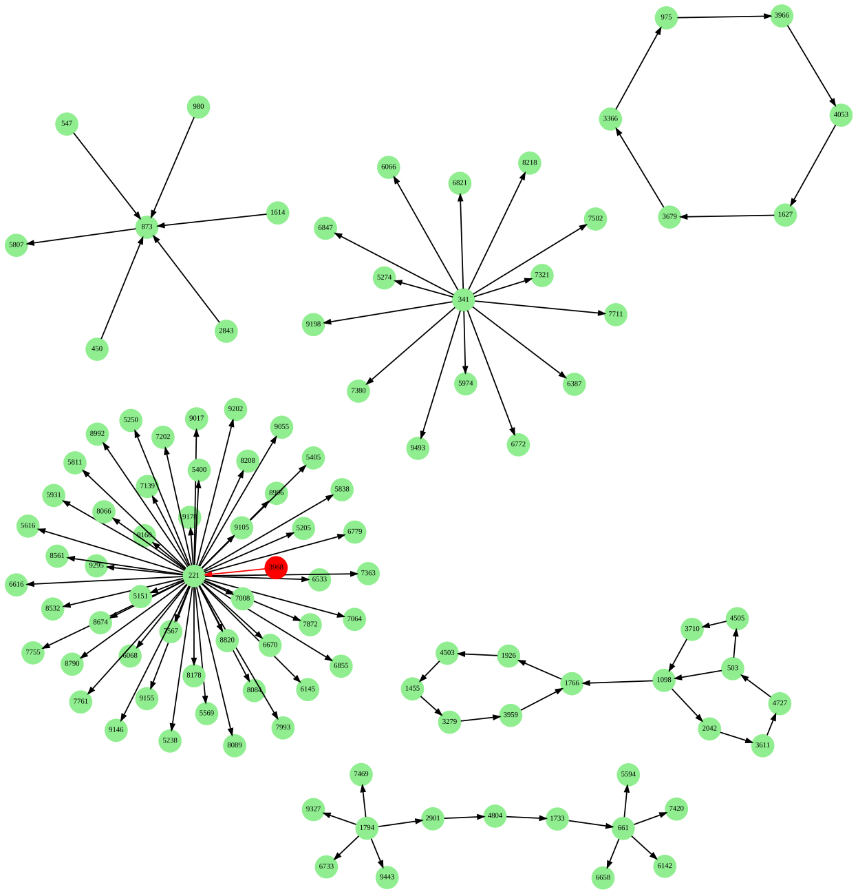

### Эксперимент с графовой базой данных

- Установка NebulaGraph    
- Считывание данных из источника    
- Внесение данных из таблицы в графовую БД    
- Графовое представление в БД    
  - Ориентированный граф    
    - Степени вершин    
    - Множества достижимости и контрдостижимости вершин    
    - Циклы и компоненты сильной связности    
  - Неориентированный граф    
    - Степени вершин    
    - Циклы и компоненты связности    
  - Визуализация    
- REST сервис    

